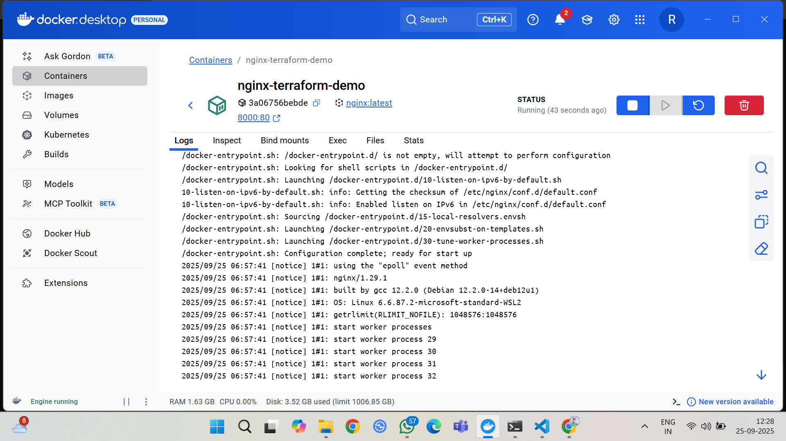
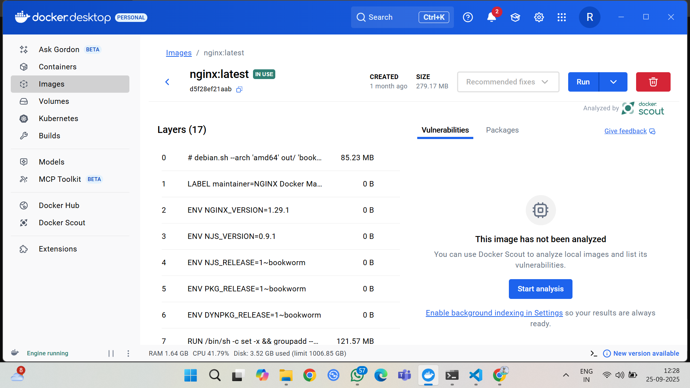
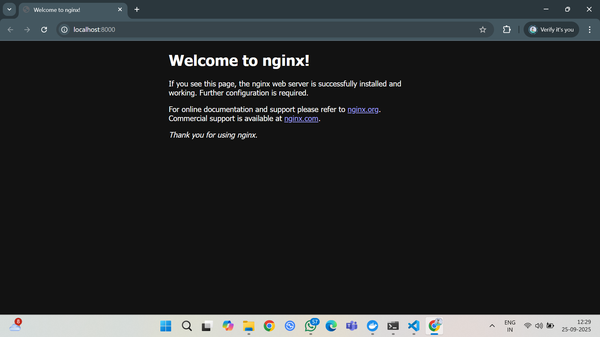

# Infrastructure as Code (IaC) with Terraform

### Overview
This repository contains the implementation of Infrastructure as Code (IaC) using Terraform to provision a local Docker container, aligning with modern DevOps practices.

### Tools
- **Terraform**: An open-source IaC tool used to define and provision infrastructure.
- **Docker**: A platform for developing, shipping, and running applications inside containers.

### Deliverables
- **`main.tf`**: The Terraform configuration file defining the infrastructure setup.
- **Execution Logs**:
  - `init.log`: Output from the `terraform init` command.
  - `plan.log`: Output from the `terraform plan` command.
  - `apply.log`: Output from the `terraform apply` command.
  - `state.log`: Output from the `terraform state list` command.
  - `destroy.log`: Output from the `terraform destroy` command.

### ImplementationSteps
1. Created a project directory (`terraform-docker-task`) and added `main.tf` with Terraform configuration for an NGINX container.
2. Executed Terraform commands:
   - `terraform init` to initialize the environment.
   - `terraform plan` to preview changes.
   - `terraform apply` to provision the container.
   - `terraform state list` to check managed resources.
   - `terraform destroy` to clean up.
3. Captured outputs in respective log files.
4. Set up this GitHub repository for submission.

### VerificationSteps
- Clone the repository: `git clone <repository-url>`.
- Navigate to the directory: `cd terraform-docker-task`.
- Ensure Docker and Terraform are installed and Docker is running.
- Run the commands in sequence:
  - `terraform init`
  - `terraform plan`
  - `terraform apply` (type 'yes' to confirm)
  - `terraform state list`
  - `terraform destroy` (type 'yes' to confirm)
- Verify the NGINX container at `http://localhost:8000`.

## 📸 Screenshots

### ✅ Successful Docker Container Run and image

### NGINX Server

### Acknowledgments
Completed as part of the Elevate & Labs DevOps Internship, supported by the Ministry of Electronics and Information Technology, Government of India.

